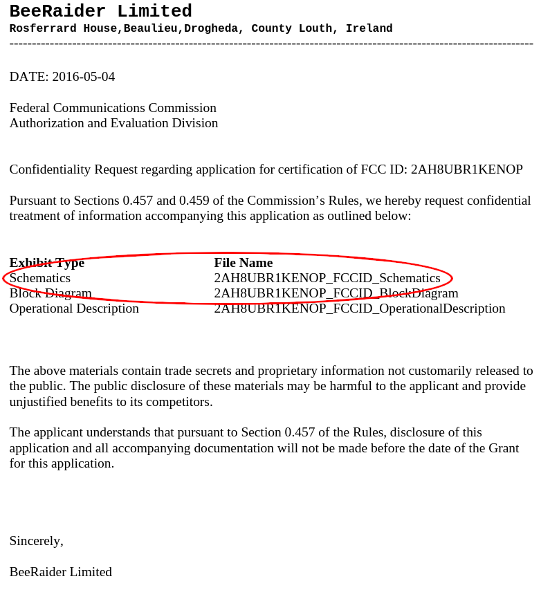
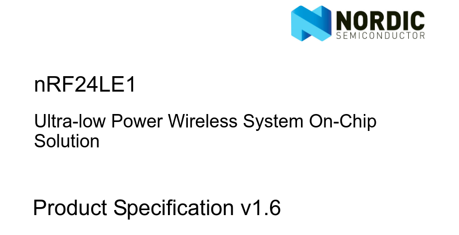
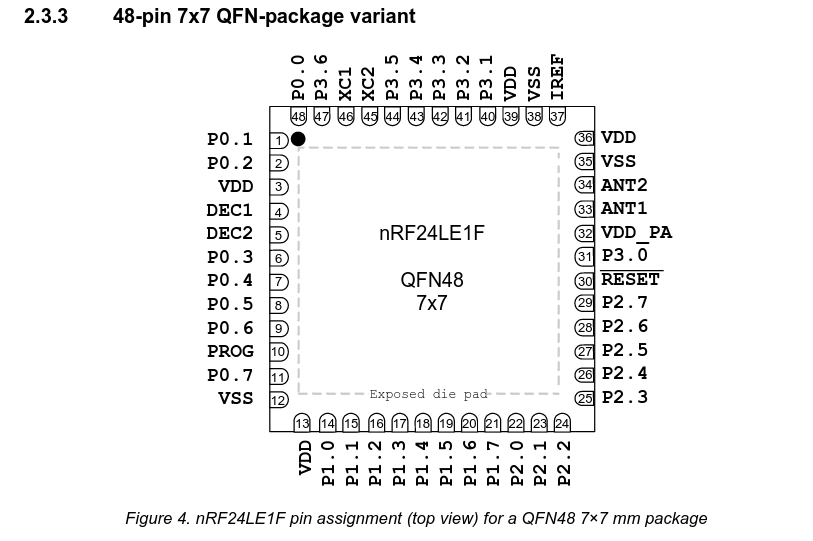
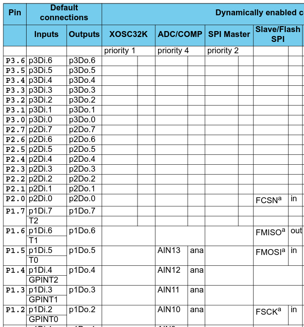
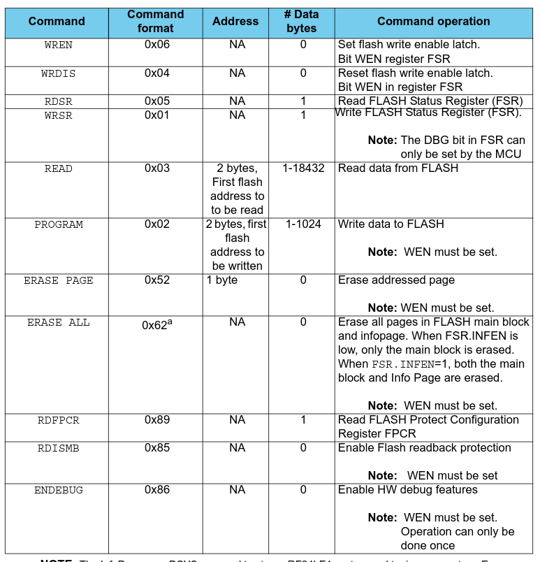
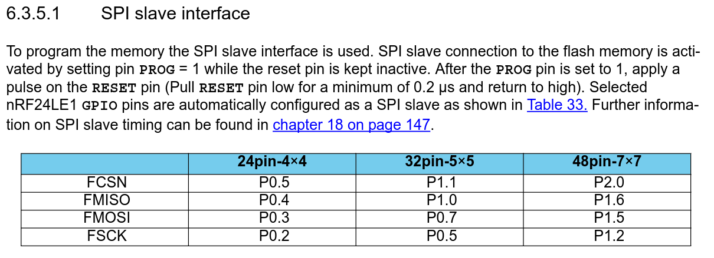
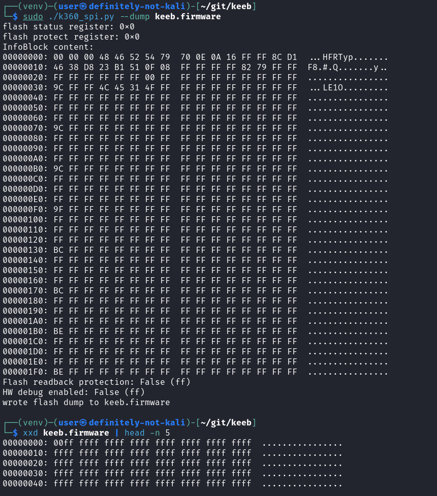

% Firmware Hacking & Guerrilla Patching

# whoami?

<br>

::: incremental

 - Chandler
	 - aka Throwaway2155
 - General Tinkerer
 - Flag Capturer
 - Security Analyst

:::

<br>
<br>

# How do you actually dump firmware?

## [ What kinda chip you got? ]{.no_title_overflow}

<br>

::: incremental
 - Download it from the internet
 - Bootloader (UART, mass storage device, etc)
 - JTAG
 - SPI
:::

<br>
<br>

::: notes
Internet downloads are more common with complex appliance type devices that recieve security updates such as ip cams and routers.

The bootloader giving you easy access to the firmware is more common with hacker friendly dev boards.

JTAG is probably the most common interface for embedded systems.

SPI is for less complex machines than JTAG.
:::

## Our Target

::: fragment

:::

::: notes
Vulnerable to MouseJack
:::


## Our Target

<br>

::: big_img


:::

::: notes
nRF24le1<br>
Cant be jtag since its 2 pins short (needs 10 pins)<br>
There is no standard 8 pin debug interface
:::

<br>

## Gathering Info

::: fragment 
::: big_img

:::
:::

::: notes
One of the first searches is the fcc website<br>
:::

## Gathering Info

::: fragment

:::

## [ DataSheet Recon ]{.no_title_overflow}

::: fragment

:::

:::notes
There are three variants of this chip<br>
The black dot is a dimple for orientation
:::

## [ Tracing the PCB ]{.no_title_overflow}

<br>

::: incremental
::: flex_container

::: big_img

:::

::: largish_list 
 - 1: vdd (3v3)
 - 2: RESET
 - 3: vss (Ground)
 - 4: p2.0 
 - 5: PROG
 - 6: p1.6 
 - 7: p1.2 
 - 8: p1.5 
:::

:::
:::

::: notes
Digital microscope<br>
Barring that your phone and a flashlight<br>
GIMP
:::

<br>
<br>

## [GPIO?]{.no_title_overflow}

:::incremental
::: flex_container
:::fragment

:::

::: largish_list 
 - 1: vdd (3v3)
 - 2: RESET
 - 3: vss (Ground)
 - 4: p2.0 (CSN)
 - 5: PROG
 - 6: p1.6 (MISO)
 - 7: p1.2 (SCK)
 - 8: p1.5 (MOSI)
:::
:::
:::

## [SPI?]{.no_title_overflow}

<br>

::: incremental
 - Serial Protocol
 - 4 Pin, full duplex
 - 3 Pin, half duplex
 - Daisychain-able
:::

<br>
<br>

::: notes
Serial Peripheral Interface<br>
2 pin == i2c<br>
1 pin == 1 wire
:::

## [SPI? Pins]{.no_title_overflow}

<br>
<br>

::: incremental
 - MOSI -> Main Out Sub In
 - MISO -> Main In Sub Out
 - SCLK -> Serial Clock 
 -   CS -> Chip Select
:::

<br>
<br>
<br>

::: notes
The serial clock comes from main, This is one of the reason's it's easy to bit-bang

Chip Select is active low from main
:::

## [Wire Up The Board]{.no_title_overflow}

::: fragment

:::

<br>
<br>

::: notes
Blue : MISO<br>
Yellow : MOSI<br>
Orange : Clock<br>
Green : Chip Select<br>
White : RESET<br>
Grey : PROG<br>
Red : 3v3<br>
Black : Ground

POGO Pins are a nessessity 
:::

## [Dump That Firmware?]{.no_title_overflow}

::: flex_container
::: fragment

::: bigish_img

:::

:::

::: incremental
 - ```0x03 0x00```

 - ```0xFF```
:::
:::

## [No Data?]{.no_title_overflow}

<br>

::: fragment

:::

<br>
<br>

::: notes
Pull PROG high<br>
Pulse RESET<br>

RESET is active low
:::

## [Dump That Firmware!]{.no_title_overflow}

<br>
<br>
<br>

::: incremental
 - ```0x03 0x00```
 - ```0xFF```
:::

<br>
<br>
<br>
<br>

## [Roll for Sanity]{.no_title_overflow}

<br>

::: incremental
::: largish_list
 - BusPirate => GreatFET
 - jamchamb => [https://jamchamb.net/2021/05/29/dumping-k360-firmware.html](https://jamchamb.net/2021/05/29/dumping-k360-firmware.html)
 - Script => [https://gist.github.com/jamchamb/b2892a22ac0760346d4d617fedf9b541](https://gist.github.com/jamchamb/b2892a22ac0760346d4d617fedf9b541)
:::
:::

<br>
<br>
<br>

## [Dump That Firmware.]{.no_title_overflow}

::: fragment
::: big_img

:::
:::

::: notes
Accidentally overwrote the firmware
:::

# [Guerrilla Patching]{.no_title_overflow}

## Methods

<br>

::: incremental
::: large_list
 - Rewrite the firmware
     - C or MicroPython
     - No reverse engineering
     - Implement everything already existing in the firmware
     - Might have to pay for vendor's special sauce (SDK and/or Compiler)
 - Create a binary patch
     - Must be familiar with asm
     - Must be familiar with hooking and code caves
     - Not always possible 
     - Heavy RE project
:::
:::

<br>
<br>

## [Rewrite the firmware]{.no_title_overflow}

<br>
<br>

::: incremental
::: largish_list
 - 8051 Instruction set
 - Free (as in beer) SDK and Compiler [https://www.nordicsemi.com/Products/nRF24-series](https://www.nordicsemi.com/Products/nRF24-series)
 - Blog? Store? [https://danjuliodesigns.com/projects/nrf_prog.html](https://danjuliodesigns.com/projects/nrf_prog.html)
    - Opensource Compiler [https://sdcc.sourceforge.net](https://sdcc.sourceforge.net) 
    - Opensource SDK (dead) [https://www.diyembedded.com/lib/nrf24le1/lib_nrf24le1_sdk_v4.0.zip](https://web.archive.org/web/20160630011745/https://www.diyembedded.com/lib/nrf24le1/lib_nrf24le1_sdk_v4.0.zip)
:::
:::

<br>
<br>
<br>
<br>

## [Binary Patching]{.no_title_overflow}

::: incremental
 - Dissassembler of choice
    - IDA Pro
    - Ghidra
 - Only 255 opcodes (43 instructions)
    - Could build your own dissassembler
    - Or use someone elses [https://github.com/w0qs1/disgeek51](https://github.com/w0qs1/disgeek51)
:::
::: notes
x86 has anywhere between 64 and roughly a million opcodes
:::

## Your Turn

::: incremental
 - Find a simple embedded device
 - Dump the firmware
 - Make a patch or custom firmware
:::
::: notes
There is an Anker power bank that can be modified to have badusb capabilities. 
:::

# EOF


[https://github.com/sudo-d4s3/nrf24-firmware-slides](https://github.com/sudo-d4s3/nrf24-firmware-slides)
